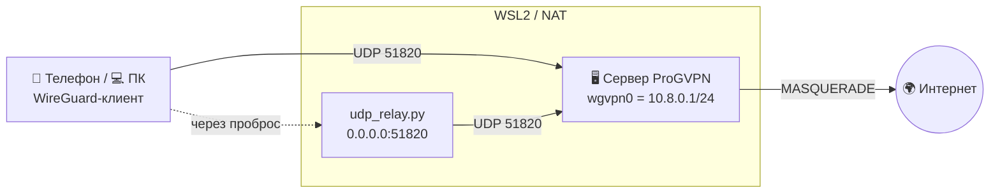

<div align="center">


# 🛡️ ProGVPN

**Свой WireGuard VPN на Python — сервер, Windows-GUI, CLI и Android-приложение.**

[](https://www.python.org/)
[](https://www.wireguard.com/)
[](https://github.com/)
[](https://kivy.org/)
[](LICENSE)

</div>

---

ProGVPN — это набор простых обёрток над **официальным WireGuard**: поднять сервер одной командой, выпускать клиентов, подключаться с Windows/телефона и получать QR-код для официального приложения WireGuard.

## ✨ Возможности

| Компонент | Что делает |
|---|---|
| 🖥️ **`server.py`** | Сервер: `init`, `peer-add`, `peer-list`, `peer-del`, `conf`, `up`, `down`, `status`. Автоматически настраивает NAT (`ip_forward` + `MASQUERADE`) |
| 💻 **`client.py`** | CLI-клиент: `import`, `gen`, `up`, `down`, `status` |
| 🎨 **`client_gui.py`** | Тёмный Windows-GUI: кастомное окно, градиентные неоновые кнопки, индикатор статуса, QR-код |
| 🔁 **`udp_relay.py`** | UDP-проброс порта клиента → WireGuard внутри WSL2/за NAT (Windows) |
| 📱 **`android/`** | Kivy-приложение: генерация QR, импорт/экспорт `.conf`, вставка из буфера |
| 🧰 **`tools/`** | Диагностика драйвера WireGuard и туннеля на Windows |

## 🏗️ Как это работает



- Внутренняя сеть VPN — `10.8.0.0/24`, сервер `10.8.0.1`, клиенты `10.8.0.2+`.
- Клиентские `.conf` экспортируются в `clients/` и импортируются в приложение WireGuard.

## 📂 Структура

```
ProGVPN/
├── server.py            # сервер (Linux / VPS / WSL2)
├── client.py            # CLI-клиент
├── client_gui.py        # Windows GUI (tkinter + Pillow)
├── udp_relay.py         # UDP-проброс для WSL2 / за NAT
├── ProGVPN.spec         # PyInstaller-спекта для сборки .exe
├── app.ico              # иконка приложения
├── assets/              # логотипы
├── tools/               # диагностика (Windows)
└── android/             # Kivy-приложение (buildozer)
    ├── main.py
    ├── buildozer.spec
    └── assets/
```

## 🚀 Быстрый старт

### 1. Сервер (Linux / VPS / WSL2)

```bash
sudo apt update && sudo apt install -y wireguard-tools iptables

# инициализация (--public — твой внешний IP/домен)
python3 server.py init --public YOUR_SERVER_IP

# добавить клиента (сгенерирует ключи и выгрузит clients/<имя>.conf)
python3 server.py peer-add phone --endpoint YOUR_SERVER_IP:51820

# поднять интерфейс + NAT
sudo python3 server.py up

# проверка
sudo python3 server.py status
```

> Открой **UDP 51820** в фаерволе провайдера и локально: `sudo ufw allow 51820/udp`.

### 2. Клиент (CLI, Linux)

```bash
python3 client.py import clients/phone.conf
sudo python3 client.py up
python3 client.py status
```

### 3. Windows GUI

```powershell
pip install pillow
python client_gui.py
# или собрать .exe:
pyinstaller ProGVPN.spec
```

### 4. Android-приложение

```bash
cd android
pip install buildozer cython
buildozer -v android debug
# результат: android/bin/*.apk
```

Приложение принимает `.conf`, генерирует QR для официального WireGuard и умеет импортировать/экспортировать конфиг файлом.

### 5. Проброс UDP (когда сервер в WSL2 или за NAT)

Если сервер живёт в WSL2 (его IP не виден снаружи) — запусти на **хосте**:

```powershell
python udp_relay.py 51820 172.28.202.176          # внешний порт 51820 → WSL
python udp_relay.py 54321 172.28.202.176 51820    # если 51820 занят Windows
```

В конфиге клиента указывай `Endpoint = IP_ХОСТА:порт`.

## 🔒 Безопасность

- **Не коммитьте** `clients/*.conf` и `.progvpn/` — там **приватные ключи** (уже в `.gitignore`).
- Приватный ключ клиента должен знать только клиент. Для продакшена генерируйте ключи на стороне клиента и передавайте серверу лишь публичный.
- Preshared key (PSK) добавляет дополнительный слой симметричного шифрования.

## 🛠️ Решение проблем

| Симптом | Причина / решение |
|---|---|
| `PermissionError [WinError 10013]` при `bind` | Порт попал в зарезервированный Windows диапазон (`netsh int ipv4 show excludedportrange protocol=udp`) → возьмите другой порт, напр. `54321` |
| `ConnectionResetError [WinError 10054]` в релее | ICMP «порт недоступен» от ушедшего клиента — обрабатывается и игнорируется |
| Клиент шлёт, сервер пустой (`wg show` без peer) | Сервер не знает клиента → `python server.py peer-add …` и `sudo python3 server.py up` |
| Туннель есть, но интернета нет | Нет NAT на сервере → `sudo python3 server.py up` (применяет `MASQUERADE`) |
| Пропал интернет на клиенте после подключения | Полный туннель при нерабочем сервере; для отладки поставьте `AllowedIPs = 10.8.0.0/24` |
| IPv6 не работает | Уберите `::/0` из `AllowedIPs`, если у сервера нет IPv6 |

## 📄 Лицензия

Проект распространяется под лицензией **MIT** — см. [LICENSE](LICENSE).

<div align="center"><sub>Сделано с ❤️ на Python, WireGuard и Kivy</sub></div>
